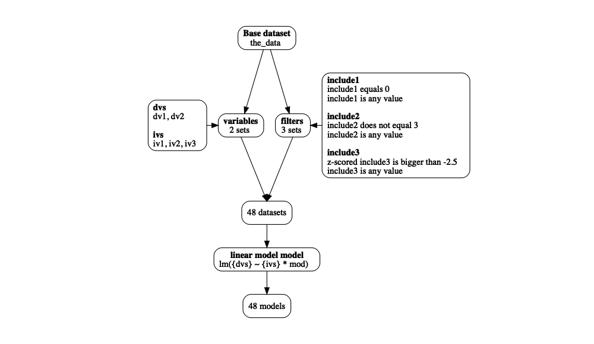

<!-- README.md is generated from README.Rmd. Please edit that file -->

# multitool <a href="https://ethan-young.github.io/multitool/"></a>

<!-- badges: start -->

[](https://lifecycle.r-lib.org/articles/stages.html#experimental)
[](https://CRAN.R-project.org/package=multitool)
[](https://github.com/ethan-young/multiverse_tools/actions/workflows/R-CMD-check.yaml)
<!-- badges: end -->

The goal of `multitool` is to provide a set of tools for designing and
running multiverse-style analyses. My goal with this package is to
create an incremental workflow for slowly building up, keeping track of,
and unpacking multiverse analyses and results.

I designed `multitool` to help users take a single use case (e.g., a
single analysis pipeline) and expand it into a workflow to include
alternative versions of the same analysis.

For example, imagine you would like to take some data, remove outliers,
transform variables, run a linear model, do a post-hoc analysis, and
plot the results. `multitool` can take theses tasks and transform them
into a *specification blueprint*, which provides instructions for
running your analysis pipeline.

The functions were designed to play nice with the
[`tidyverse`](https://www.tidyverse.org/) and require using the base R
pipe `|>`. This makes it easy to quickly convert a single analysis into
a multiverse analysis.

## Basic components

My vision of a multiverse workflow contains three parts.

1.  **Base data:** original dataset waiting for further processing
2.  **specification blueprint:** aka specification grid. This a
    blueprint/map/recipe or whatever you want to call it. These are the
    instructions for what to do.
3.  **Multiverse results:** a table of results after feeding the base
    data to the blueprint.

A defining feature of `multitool` is that it saves pipeline code. This
allows the user to grab the *code that produces a result* and inspect it
for accuracy, errors, or simply for peace of mind. By quickly grabbing
code, the user can iterate between creating their blueprint and checking
that the code works as intended.

`multitool` allows the user to model data however they’d like. The user
is responsible for loading the relevant modeling packages. Regardless of
your model choice, `multitool` will capture your code and build a
pipeline.

Finally, multiverse analyses were originally intended to look at how
model parameters shift as a function of arbitrary analysis decisions.
However, any computation might change depending on how you slice and
dice the data. For this reason, I also built functions for computing
descriptive, correlation, and reliability analysis alongside a
particular modelling pipeline.

## Installation

You can install the development version of `multitool` from
[GitHub](https://github.com/) with:

``` r
# install.packages("devtools")
devtools::install_github("ethan-young/multitool")
```

## Example

``` r
library(tidyverse)
library(multitool)
```

## The base data

Image we have some data with several predictor variables, moderators,
covariates, and dependent measures. We want to know if our predictors
(`ivs`) interact with our moderators (`mods`) to predict the outcome
(`dvs`).

But we have three versions of our predictor that measuring the same
construct in a different way.

In addition, because we collected messy data from the real world (not
really but let’s pretend), we have some idea of exclusions we might need
to make (e.g., `include1`, `include2`, `include3`).

``` r
the_data <-
  data.frame(
    id  = 1:500,
    iv1 = rnorm(500),
    iv2 = rnorm(500),
    iv3 = rnorm(500),
    mod = rnorm(500),
    dv1 = rnorm(500),
    dv2 = rnorm(500),
    include1 = rbinom(500, size = 1, prob = .1),
    include2 = sample(1:3, size = 500, replace = TRUE),
    include3 = rnorm(500)
  )
```

## Create a blueprint

Say we don’t know much about this new and exciting area of research.

We want to maximize our knowledge but we also want to be systematic. One
approach would be to specify a reasonable analysis pipeline. Something
that looks like the following:

``` r
# Filter out exclusions
filtered_data <- 
  the_data |> 
  filter(
    include1 == 0,           # --
    include2 != 3,           # Exclusion criteria
    scale(include3) > -2.5   # --
  )

# Model the data
my_model <- lm(dv1 ~ iv1 * mod, data = filtered_data)

# Check the results
my_results <- broom::tidy(my_model)
```

But what if there are valid alternative alternatives to this pipeline?

For example, using `iv2` instead of `iv1` or only using two exclusion
criteria instead of three? A sensible approach would be to copy the code
above, paste it, and edit with different decisions.

This quickly become tedious. It adds many lines of code, many new
objects, and is difficult to keep track of in a systematic way. Enter
`multitool`.

With `multitool`, the above analysis pipeline can be transformed into a
grid – a specification blueprint – for exploring all combinations of
sensible data decisions in a pipeline. It was designed to leverage
already written code (e.g., the `filter` statement above) to create a
multiverse of data analysis pipelines.

## Filtering specifications

Our example above has three exclusion criteria. If we don’t know which
are important, for example, because they are based on arbitrary ‘rules
of thumb’ (that may or may not have inherent wisdom) or we don’t know if
including/excluding these cases is valid, we can generate all
combinations:

``` r
the_data |> 
  add_filters(include1 == 0, include2 != 3, scale(include3) > -2.5)
#> # A tibble: 6 × 3
#>   type    group    code                          
#>   <chr>   <chr>    <chr>                         
#> 1 filters include1 include1 == 0                 
#> 2 filters include1 include1 %in% unique(include1)
#> 3 filters include2 include2 != 3                 
#> 4 filters include2 include2 %in% unique(include2)
#> 5 filters include3 scale(include3) > -2.5        
#> 6 filters include3 include3 %in% unique(include3)
```

The output above is a simple `tibble` (i.e., `data.frame`) containing
three columns.

Each row is a possible filter: the `type` column refers to the type of
blueprint specification (see below for types other than filters), the
`group` refers to the variable in the base data frame (in our case
`the_data`) for which the filter applies, and the `code` column contains
the code needed to execute the filter.

For filtering decisions (e.g., exclusion criteria), a *‘do nothing’*
alternative is always generated.

For example, perhaps some observations belong to a subgroup,
`include1 == 1`. We may or may not have good reason to exclude these
cases (this depends on the specific situation).

But imagine that we don’t know if we should include them or not. When
`include1 == 1` is added to `add_filters()`, the *‘do nothing’*
alternative `include1 %in% unique(include1)` is automatically generated
so you can compare including versus excluding cases based on a
criterion.

## Adding alternative analysis variables

Most multiverse-style analyses explore a range of exclusion criteria and
their alternatives. However, sometimes alternative versions of a
variable are also included.

In the social sciences, it is fairly common to have many measures of
roughly the same construct (i.e., measured variable). For example, a
happiness researcher might measure positive mood, life satisfaction,
and/or a single item measuring happiness (e.g., ‘how happy do your
feel?’).

If you want to explore the output of your pipeline with differing
versions of a variable, you can use `add_variables()`.

``` r
the_data |>
  add_variables(var_group = "ivs", iv1, iv2, iv3)
#> # A tibble: 3 × 3
#>   type      group code 
#>   <chr>     <chr> <chr>
#> 1 variables ivs   iv1  
#> 2 variables ivs   iv2  
#> 3 variables ivs   iv3
```

The output above generates the same `tibble` as `add_filters()`. Each
row is a particular decision to use a particular variable in your
pipeline.

In contrast to filter, however, you need to tell `add_variables()` what
to call each set of variables with the `var_group` argument. This is how
`multitool` knows that each variable name in the `code` column is a
different alternative of a larger set.

Here, `var_group = "ivs"` indicates that `iv1, iv2, iv3` are all
different versions of `ivs`. I used “ivs” as way of indicating to myself
that these are alternative versions of my main independent variable.

You can add as many variable sets as you want. For example, we might
also want to analyze our two versions of the outcome, `dv1` and `dv2`.

``` r
the_data |>
  add_variables(var_group = "ivs", iv1, iv2, iv3) |> 
  add_variables(var_group = "dvs", dv1, dv2)
#> # A tibble: 5 × 3
#>   type      group code 
#>   <chr>     <chr> <chr>
#> 1 variables ivs   iv1  
#> 2 variables ivs   iv2  
#> 3 variables ivs   iv3  
#> 4 variables dvs   dv1  
#> 5 variables dvs   dv2
```

## Building up the blueprint

You can harness the real power of `multitool` by piping specification
statements. For example, perhaps we want to explore our exclusion
criteria alternatives across different versions of our predictor and
outcome variables. We can simply pipe new blueprint specifications into
each other like so:

``` r
the_data |>
  add_filters(include1 == 0, include2 != 3, scale(include3) > -2.5) |> 
  add_variables(var_group = "ivs", iv1, iv2, iv3) |> 
  add_variables(var_group = "dvs", dv1, dv2)
#> # A tibble: 11 × 3
#>    type      group    code                          
#>    <chr>     <chr>    <chr>                         
#>  1 filters   include1 include1 == 0                 
#>  2 filters   include1 include1 %in% unique(include1)
#>  3 filters   include2 include2 != 3                 
#>  4 filters   include2 include2 %in% unique(include2)
#>  5 filters   include3 scale(include3) > -2.5        
#>  6 filters   include3 include3 %in% unique(include3)
#>  7 variables ivs      iv1                           
#>  8 variables ivs      iv2                           
#>  9 variables ivs      iv3                           
#> 10 variables dvs      dv1                           
#> 11 variables dvs      dv2
```

Notice that we now have a specification blueprint with both exclusion
alternatives and variable alternatives.

## Adding a model

The whole point of building a specification blueprint is to eventually
feed it to a model and examine the results.

You can add a model to your blueprint by using `add_model()`. I designed
`add_model()` so the user can simply paste a model function. For
example, our call to `lm()` can be simply pasted into `add_model()`.
Make sure to give your model a label with the `model_desc` argument.

``` r
the_data |>
  add_filters(include1 == 0, include2 != 3, scale(include3) > -2.5) |> 
  add_variables(var_group = "ivs", iv1, iv2, iv3) |> 
  add_variables(var_group = "dvs", dv1, dv2) |> 
  add_model("linear model", lm(dv1 ~ iv1 * mod))
#> # A tibble: 12 × 3
#>    type      group        code                          
#>    <chr>     <chr>        <chr>                         
#>  1 filters   include1     include1 == 0                 
#>  2 filters   include1     include1 %in% unique(include1)
#>  3 filters   include2     include2 != 3                 
#>  4 filters   include2     include2 %in% unique(include2)
#>  5 filters   include3     scale(include3) > -2.5        
#>  6 filters   include3     include3 %in% unique(include3)
#>  7 variables ivs          iv1                           
#>  8 variables ivs          iv2                           
#>  9 variables ivs          iv3                           
#> 10 variables dvs          dv1                           
#> 11 variables dvs          dv2                           
#> 12 models    linear model lm(dv1 ~ iv1 * mod)
```

Above, the model is completely unquoted. It also has no `data` argument.
This is intentional; `multitool` is tracking the base dataset along the
way (so you don’t have to). Note that you can still quote the model
formula, if that is more your style.

``` r
the_data |>
  add_filters(include1 == 0, include2 != 3, scale(include3) > -2.5) |>
  add_variables(var_group = "ivs", iv1, iv2, iv3) |> 
  add_variables(var_group = "dvs", dv1, dv2) |> 
  add_model("lm(dv1 ~ iv1 * mod)")
#> # A tibble: 12 × 3
#>    type      group               code                            
#>    <chr>     <chr>               <chr>                           
#>  1 filters   include1            "include1 == 0"                 
#>  2 filters   include1            "include1 %in% unique(include1)"
#>  3 filters   include2            "include2 != 3"                 
#>  4 filters   include2            "include2 %in% unique(include2)"
#>  5 filters   include3            "scale(include3) > -2.5"        
#>  6 filters   include3            "include3 %in% unique(include3)"
#>  7 variables ivs                 "iv1"                           
#>  8 variables ivs                 "iv2"                           
#>  9 variables ivs                 "iv3"                           
#> 10 variables dvs                 "dv1"                           
#> 11 variables dvs                 "dv2"                           
#> 12 models    lm(dv1 ~ iv1 * mod) ""
```

To make sure your `add_variables()` works properly, `add_model()` was
designed to interpret `glue::glue()` syntax. For example:

``` r
the_data |>
  add_filters(include1 == 0, include2 != 3, scale(include3) > -2.5) |> 
  add_variables(var_group = "ivs", iv1, iv2, iv3) |> 
  add_variables(var_group = "dvs", dv1, dv2) |> 
  add_model("linear model",lm({dvs} ~ {ivs} * mod))
#> # A tibble: 12 × 3
#>    type      group        code                          
#>    <chr>     <chr>        <chr>                         
#>  1 filters   include1     include1 == 0                 
#>  2 filters   include1     include1 %in% unique(include1)
#>  3 filters   include2     include2 != 3                 
#>  4 filters   include2     include2 %in% unique(include2)
#>  5 filters   include3     scale(include3) > -2.5        
#>  6 filters   include3     include3 %in% unique(include3)
#>  7 variables ivs          iv1                           
#>  8 variables ivs          iv2                           
#>  9 variables ivs          iv3                           
#> 10 variables dvs          dv1                           
#> 11 variables dvs          dv2                           
#> 12 models    linear model lm({dvs} ~ {ivs} * mod)
```

This allows `multitool` to insert the correct version of each variable
specified in a `add_variables()` step. Make sure to use embrace the
variable with the `var_group` argument from `add_variables()`, for
example `add_model(lm({dvs} ~ {ivs} * mod))`. Here, `{dvs}` and `{ivs}`
tells `multitool` to insert the current version of the `ivs` and `dvs`
into the model.

## Finalizing the specification blueprint

There are two steps in finalizing your bluerpint. The first is to
visualize your pipeline with a graph. This is optional, but I think it
is helpful.

You can automate making a chart with `blueprint()`. Feed your pipeline
to `blueprint()` to see a chart of your multiverse pipeline plan:

``` r
full_pipeline <- 
  the_data |>
  add_filters(include1 == 0, include2 != 3, scale(include3) > -2.5) |> 
  add_variables(var_group = "ivs", iv1, iv2, iv3) |> 
  add_variables(var_group = "dvs", dv1, dv2) |> 
  add_model("linear model", lm({dvs} ~ {ivs} * mod))

blueprint(full_pipeline)
```



The final step in making your blueprint is expanding all your
specifications into all possible combinations. You can do this by
calling `expand_decisions()` at the end of your blueprint pipeline:

``` r
expanded_pipeline <- expand_decisions(full_pipeline)

expanded_pipeline
#> # A tibble: 48 × 4
#>    decision variables        filters          models          
#>    <chr>    <list>           <list>           <list>          
#>  1 1        <tibble [1 × 2]> <tibble [1 × 3]> <tibble [1 × 2]>
#>  2 2        <tibble [1 × 2]> <tibble [1 × 3]> <tibble [1 × 2]>
#>  3 3        <tibble [1 × 2]> <tibble [1 × 3]> <tibble [1 × 2]>
#>  4 4        <tibble [1 × 2]> <tibble [1 × 3]> <tibble [1 × 2]>
#>  5 5        <tibble [1 × 2]> <tibble [1 × 3]> <tibble [1 × 2]>
#>  6 6        <tibble [1 × 2]> <tibble [1 × 3]> <tibble [1 × 2]>
#>  7 7        <tibble [1 × 2]> <tibble [1 × 3]> <tibble [1 × 2]>
#>  8 8        <tibble [1 × 2]> <tibble [1 × 3]> <tibble [1 × 2]>
#>  9 9        <tibble [1 × 2]> <tibble [1 × 3]> <tibble [1 × 2]>
#> 10 10       <tibble [1 × 2]> <tibble [1 × 3]> <tibble [1 × 2]>
#> # ℹ 38 more rows
```

The result is an expanded `tibble` with 1 row per unique decision and
columns for each major blueprint category. In our example, we have
alternative variables (predictors and outcomes), filters (three
exclusion alternatives), and a model to run.

Note that we have 3 exclusions (each with two combinations), 3 versions
of our predictor, and 2 versions of our outcome. This means our
blueprint should have `2*2*2*3*2` rows.

``` r
2*2*2*3*2 == nrow(full_pipeline)
#> [1] FALSE
```

Our blueprint uses list columns to organize information. You can view
each list column by using `tidyr::unnest(<column name>)`. For example,
we can look at the filters:

``` r
expanded_pipeline |> unnest(filters)
#> # A tibble: 48 × 6
#>    decision variables        include1      include2      include3       models  
#>    <chr>    <list>           <chr>         <chr>         <chr>          <list>  
#>  1 1        <tibble [1 × 2]> include1 == 0 include2 != 3 scale(include… <tibble>
#>  2 2        <tibble [1 × 2]> include1 == 0 include2 != 3 scale(include… <tibble>
#>  3 3        <tibble [1 × 2]> include1 == 0 include2 != 3 scale(include… <tibble>
#>  4 4        <tibble [1 × 2]> include1 == 0 include2 != 3 scale(include… <tibble>
#>  5 5        <tibble [1 × 2]> include1 == 0 include2 != 3 scale(include… <tibble>
#>  6 6        <tibble [1 × 2]> include1 == 0 include2 != 3 scale(include… <tibble>
#>  7 7        <tibble [1 × 2]> include1 == 0 include2 != 3 include3 %in%… <tibble>
#>  8 8        <tibble [1 × 2]> include1 == 0 include2 != 3 include3 %in%… <tibble>
#>  9 9        <tibble [1 × 2]> include1 == 0 include2 != 3 include3 %in%… <tibble>
#> 10 10       <tibble [1 × 2]> include1 == 0 include2 != 3 include3 %in%… <tibble>
#> # ℹ 38 more rows
```

Or we could look at the models:

``` r
expanded_pipeline |> unnest(models)
#> # A tibble: 48 × 5
#>    decision variables        filters          model               model_meta  
#>    <chr>    <list>           <list>           <chr>               <chr>       
#>  1 1        <tibble [1 × 2]> <tibble [1 × 3]> lm(dv1 ~ iv1 * mod) linear model
#>  2 2        <tibble [1 × 2]> <tibble [1 × 3]> lm(dv2 ~ iv1 * mod) linear model
#>  3 3        <tibble [1 × 2]> <tibble [1 × 3]> lm(dv1 ~ iv2 * mod) linear model
#>  4 4        <tibble [1 × 2]> <tibble [1 × 3]> lm(dv2 ~ iv2 * mod) linear model
#>  5 5        <tibble [1 × 2]> <tibble [1 × 3]> lm(dv1 ~ iv3 * mod) linear model
#>  6 6        <tibble [1 × 2]> <tibble [1 × 3]> lm(dv2 ~ iv3 * mod) linear model
#>  7 7        <tibble [1 × 2]> <tibble [1 × 3]> lm(dv1 ~ iv1 * mod) linear model
#>  8 8        <tibble [1 × 2]> <tibble [1 × 3]> lm(dv2 ~ iv1 * mod) linear model
#>  9 9        <tibble [1 × 2]> <tibble [1 × 3]> lm(dv1 ~ iv2 * mod) linear model
#> 10 10       <tibble [1 × 2]> <tibble [1 × 3]> lm(dv2 ~ iv2 * mod) linear model
#> # ℹ 38 more rows
```

Notice that, with the `glue::glue()` syntax, different versions of our
predictors and outcomes were inserted appropriately. You can check their
correspondence by using `unnest()` on both the models and variable list
columns:

``` r
expanded_pipeline |> unnest(c(variables, models))
#> # A tibble: 48 × 6
#>    decision ivs   dvs   filters          model               model_meta  
#>    <chr>    <chr> <chr> <list>           <chr>               <chr>       
#>  1 1        iv1   dv1   <tibble [1 × 3]> lm(dv1 ~ iv1 * mod) linear model
#>  2 2        iv1   dv2   <tibble [1 × 3]> lm(dv2 ~ iv1 * mod) linear model
#>  3 3        iv2   dv1   <tibble [1 × 3]> lm(dv1 ~ iv2 * mod) linear model
#>  4 4        iv2   dv2   <tibble [1 × 3]> lm(dv2 ~ iv2 * mod) linear model
#>  5 5        iv3   dv1   <tibble [1 × 3]> lm(dv1 ~ iv3 * mod) linear model
#>  6 6        iv3   dv2   <tibble [1 × 3]> lm(dv2 ~ iv3 * mod) linear model
#>  7 7        iv1   dv1   <tibble [1 × 3]> lm(dv1 ~ iv1 * mod) linear model
#>  8 8        iv1   dv2   <tibble [1 × 3]> lm(dv2 ~ iv1 * mod) linear model
#>  9 9        iv2   dv1   <tibble [1 × 3]> lm(dv1 ~ iv2 * mod) linear model
#> 10 10       iv2   dv2   <tibble [1 × 3]> lm(dv2 ~ iv2 * mod) linear model
#> # ℹ 38 more rows
```

## Validate your blueprint

A `multitool` specification blueprint has a special feature: it captures
your code and generates analysis pipelines.

A special set of functions with the `show_code_*` prefix allow you to
see the code that will be executed for a single pipeline. For example,
we can look at our filtering code for the first decision of our
blueprint:

``` r
expanded_pipeline |> show_code_filter(decision_num = 1)
#> the_data |> 
#>   filter(include1 == 0, include2 != 3, scale(include3) > -2.5)
```

These functions allow you to generate the relevant code along the
analysis pipeline. For example, we can look at our model pipeline for
decision 17 using `show_code_model(decision_num = 17)`:

``` r
expanded_pipeline |> show_code_model(decision_num = 17)
#> the_data |> 
#>   filter(include1 == 0, include2 %in% unique(include2), scale(include3) > -2.5) |> 
#>   lm(dv1 ~ iv3 * mod, data = _)
```

Setting the `copy` argument to `TRUE` allows you to send the code
straight to your clipboard. You can paste it into the source or console
for testing/editing.

You can also run individual decisions to test that they work. See below
for details about the results.

``` r
run_universe_model(expanded_pipeline, decision_num = 1)
#> # A tibble: 1 × 3
#>   decision filter_code                                              model_fitted
#>   <chr>    <glue>                                                   <list>      
#> 1 1        the_data |> filter(include1 == 0, include2 != 3, scale(… <tibble>
```

## Implement your blueprint

Once you have built your full specification blueprint and feel
comfortable with how the pipeline is executed, you can implement a full
multiverse-style analysis.

Simply use `run_multiverse(<your pipeline object>)`:

``` r
multiverse_results <- run_multiverse(expanded_pipeline)
#> ■■■■■■■■■■■■■■■ 46% | ETA: 2s■■■■■■■■■■■■■■■■■■ 56% | ETA:
#> 2s■■■■■■■■■■■■■■■■■■■ 58% | ETA: 2s■■■■■■■■■■■■■■■■■■■■ 62% | ETA:
#> 2s■■■■■■■■■■■■■■■■■■■■■ 67% | ETA: 2s■■■■■■■■■■■■■■■■■■■■■■■ 73% | ETA:
#> 1s■■■■■■■■■■■■■■■■■■■■■■■■ 77% | ETA: 1s■■■■■■■■■■■■■■■■■■■■■■■■■ 81% | ETA:
#> 1s■■■■■■■■■■■■■■■■■■■■■■■■■■■ 85% | ETA: 1s■■■■■■■■■■■■■■■■■■■■■■■■■■■ 88% |
#> ETA: 1s■■■■■■■■■■■■■■■■■■■■■■■■■■■■■ 94% | ETA: 0s

multiverse_results
#> # A tibble: 48 × 3
#>    decision specifications   model_fitted    
#>    <chr>    <list>           <list>          
#>  1 1        <tibble [1 × 4]> <tibble [1 × 5]>
#>  2 2        <tibble [1 × 4]> <tibble [1 × 5]>
#>  3 3        <tibble [1 × 4]> <tibble [1 × 5]>
#>  4 4        <tibble [1 × 4]> <tibble [1 × 5]>
#>  5 5        <tibble [1 × 4]> <tibble [1 × 5]>
#>  6 6        <tibble [1 × 4]> <tibble [1 × 5]>
#>  7 7        <tibble [1 × 4]> <tibble [1 × 5]>
#>  8 8        <tibble [1 × 4]> <tibble [1 × 5]>
#>  9 9        <tibble [1 × 4]> <tibble [1 × 5]>
#> 10 10       <tibble [1 × 4]> <tibble [1 × 5]>
#> # ℹ 38 more rows
```

The result will be another `tibble` with various list columns.

It will always contain a list column named `specifications` containing
all the information you generated in your blueprint. Next, there will be
one list column per model fitted, labelled with a suffix like so
`<your model name>_fitted`.

Here, our model used `lm()` so inside our `model_fitted` list column, we
have our results are contained in `lm_*` columns.

## Unpacking a multiverse analysis

There are two main ways to unpack and examine `multitool` results. The
first is by using `tidyr::unnest()` (similar to unpacking the
specification blueprint earlier).

### Unnest

``` r
multiverse_results |> unnest(model_fitted)
#> # A tibble: 48 × 7
#>    decision specifications   lm_code  lm_tidy  lm_glance lm_warnings lm_messages
#>    <chr>    <list>           <glue>   <list>   <list>    <list>      <list>     
#>  1 1        <tibble [1 × 4]> the_dat… <tibble> <tibble>  <tibble>    <tibble>   
#>  2 2        <tibble [1 × 4]> the_dat… <tibble> <tibble>  <tibble>    <tibble>   
#>  3 3        <tibble [1 × 4]> the_dat… <tibble> <tibble>  <tibble>    <tibble>   
#>  4 4        <tibble [1 × 4]> the_dat… <tibble> <tibble>  <tibble>    <tibble>   
#>  5 5        <tibble [1 × 4]> the_dat… <tibble> <tibble>  <tibble>    <tibble>   
#>  6 6        <tibble [1 × 4]> the_dat… <tibble> <tibble>  <tibble>    <tibble>   
#>  7 7        <tibble [1 × 4]> the_dat… <tibble> <tibble>  <tibble>    <tibble>   
#>  8 8        <tibble [1 × 4]> the_dat… <tibble> <tibble>  <tibble>    <tibble>   
#>  9 9        <tibble [1 × 4]> the_dat… <tibble> <tibble>  <tibble>    <tibble>   
#> 10 10       <tibble [1 × 4]> the_dat… <tibble> <tibble>  <tibble>    <tibble>   
#> # ℹ 38 more rows
```

Inside the `model_fitted` column, `multitool` gives us 4 columns using
the model function you ran as a prefix.

The first column is always the full code pipeline that produced the
results. In our example, this is `lm_code`. The next are results passed
to [`broom`](https://broom.tidymodels.org/) (if `tidy` and/or `glance`
methods exist). For `lm`, we have `lm_tidy` and `lm_glance`. Notice the
naming convention: `<model function>_tidy` and
`<model function>_glance`.

``` r
multiverse_results |> unnest(model_fitted) |> unnest(lm_tidy)
#> # A tibble: 192 × 11
#>    decision specifications   lm_code  term  estimate std.error statistic p.value
#>    <chr>    <list>           <glue>   <chr>    <dbl>     <dbl>     <dbl>   <dbl>
#>  1 1        <tibble [1 × 4]> the_dat… (Int…  -0.0274    0.0573    -0.478   0.633
#>  2 1        <tibble [1 × 4]> the_dat… iv1     0.0623    0.0613     1.02    0.310
#>  3 1        <tibble [1 × 4]> the_dat… mod    -0.0146    0.0557    -0.263   0.793
#>  4 1        <tibble [1 × 4]> the_dat… iv1:…   0.0307    0.0585     0.524   0.600
#>  5 2        <tibble [1 × 4]> the_dat… (Int…   0.0227    0.0587     0.386   0.699
#>  6 2        <tibble [1 × 4]> the_dat… iv1    -0.0294    0.0628    -0.469   0.640
#>  7 2        <tibble [1 × 4]> the_dat… mod     0.0489    0.0571     0.856   0.393
#>  8 2        <tibble [1 × 4]> the_dat… iv1:…   0.0644    0.0600     1.07    0.283
#>  9 3        <tibble [1 × 4]> the_dat… (Int…  -0.0154    0.0572    -0.269   0.788
#> 10 3        <tibble [1 × 4]> the_dat… iv2     0.0563    0.0544     1.04    0.301
#> # ℹ 182 more rows
#> # ℹ 3 more variables: lm_glance <list>, lm_warnings <list>, lm_messages <list>
```

The `lm_tidy` (or `<model function>_tidy`) column gives us the main
results of `lm()` per decision. These include terms, estimates, standard
errors, and p-values. `lm_glance` (or `<model function>_glance`) column
gives us model fit statistics (among other things):

``` r
multiverse_results |> unnest(model_fitted) |> unnest(lm_glance)
#> # A tibble: 48 × 18
#>    decision specifications   lm_code      lm_tidy  r.squared adj.r.squared sigma
#>    <chr>    <list>           <glue>       <list>       <dbl>         <dbl> <dbl>
#>  1 1        <tibble [1 × 4]> the_data |>… <tibble>   0.00514     -0.00516  0.978
#>  2 2        <tibble [1 × 4]> the_data |>… <tibble>   0.00751     -0.00276  1.00 
#>  3 3        <tibble [1 × 4]> the_data |>… <tibble>   0.0107       0.000467 0.975
#>  4 4        <tibble [1 × 4]> the_data |>… <tibble>   0.00598     -0.00430  1.00 
#>  5 5        <tibble [1 × 4]> the_data |>… <tibble>   0.0141       0.00392  0.973
#>  6 6        <tibble [1 × 4]> the_data |>… <tibble>   0.0187       0.00854  0.996
#>  7 7        <tibble [1 × 4]> the_data |>… <tibble>   0.00558     -0.00464  0.976
#>  8 8        <tibble [1 × 4]> the_data |>… <tibble>   0.00755     -0.00265  0.999
#>  9 9        <tibble [1 × 4]> the_data |>… <tibble>   0.0106       0.000392 0.974
#> 10 10       <tibble [1 × 4]> the_data |>… <tibble>   0.00595     -0.00426  0.999
#> # ℹ 38 more rows
#> # ℹ 11 more variables: statistic <dbl>, p.value <dbl>, df <dbl>, logLik <dbl>,
#> #   AIC <dbl>, BIC <dbl>, deviance <dbl>, df.residual <int>, nobs <int>,
#> #   lm_warnings <list>, lm_messages <list>
```

### Reveal

I wrote wrappers around the `unnest()` workflow. The main function is
`reveal()`. Pass a multiverse results `tibble` to `reveal()` and tell it
which columns to grab by indicating the column name in the `.what`
argument:

``` r
multiverse_results |> reveal(.what = model_fitted)
#> # A tibble: 48 × 7
#>    decision specifications   lm_code  lm_tidy  lm_glance lm_warnings lm_messages
#>    <chr>    <list>           <glue>   <list>   <list>    <list>      <list>     
#>  1 1        <tibble [1 × 4]> the_dat… <tibble> <tibble>  <tibble>    <tibble>   
#>  2 2        <tibble [1 × 4]> the_dat… <tibble> <tibble>  <tibble>    <tibble>   
#>  3 3        <tibble [1 × 4]> the_dat… <tibble> <tibble>  <tibble>    <tibble>   
#>  4 4        <tibble [1 × 4]> the_dat… <tibble> <tibble>  <tibble>    <tibble>   
#>  5 5        <tibble [1 × 4]> the_dat… <tibble> <tibble>  <tibble>    <tibble>   
#>  6 6        <tibble [1 × 4]> the_dat… <tibble> <tibble>  <tibble>    <tibble>   
#>  7 7        <tibble [1 × 4]> the_dat… <tibble> <tibble>  <tibble>    <tibble>   
#>  8 8        <tibble [1 × 4]> the_dat… <tibble> <tibble>  <tibble>    <tibble>   
#>  9 9        <tibble [1 × 4]> the_dat… <tibble> <tibble>  <tibble>    <tibble>   
#> 10 10       <tibble [1 × 4]> the_dat… <tibble> <tibble>  <tibble>    <tibble>   
#> # ℹ 38 more rows
```

If you want to get straight to a tidied result you can specify a
sub-list with the `.which` argument:

``` r
multiverse_results |> reveal(.what = model_fitted, .which = lm_tidy)
#> # A tibble: 192 × 7
#>    decision specifications   term        estimate std.error statistic p.value
#>    <chr>    <list>           <chr>          <dbl>     <dbl>     <dbl>   <dbl>
#>  1 1        <tibble [1 × 4]> (Intercept)  -0.0274    0.0573    -0.478   0.633
#>  2 1        <tibble [1 × 4]> iv1           0.0623    0.0613     1.02    0.310
#>  3 1        <tibble [1 × 4]> mod          -0.0146    0.0557    -0.263   0.793
#>  4 1        <tibble [1 × 4]> iv1:mod       0.0307    0.0585     0.524   0.600
#>  5 2        <tibble [1 × 4]> (Intercept)   0.0227    0.0587     0.386   0.699
#>  6 2        <tibble [1 × 4]> iv1          -0.0294    0.0628    -0.469   0.640
#>  7 2        <tibble [1 × 4]> mod           0.0489    0.0571     0.856   0.393
#>  8 2        <tibble [1 × 4]> iv1:mod       0.0644    0.0600     1.07    0.283
#>  9 3        <tibble [1 × 4]> (Intercept)  -0.0154    0.0572    -0.269   0.788
#> 10 3        <tibble [1 × 4]> iv2           0.0563    0.0544     1.04    0.301
#> # ℹ 182 more rows
```

You can also choose to expand your specification blueprint with
`.unpack_specs = TRUE` to see which decisions produced what result:

``` r
multiverse_results |> 
  reveal(.what = model_fitted, .which = lm_tidy, .unpack_specs = TRUE)
#> # A tibble: 192 × 14
#>    decision ivs   dvs   include1  include2 include3 model model_meta filter_code
#>    <chr>    <chr> <chr> <chr>     <chr>    <chr>    <chr> <chr>      <glue>     
#>  1 1        iv1   dv1   include1… include… scale(i… lm(d… linear mo… the_data |…
#>  2 1        iv1   dv1   include1… include… scale(i… lm(d… linear mo… the_data |…
#>  3 1        iv1   dv1   include1… include… scale(i… lm(d… linear mo… the_data |…
#>  4 1        iv1   dv1   include1… include… scale(i… lm(d… linear mo… the_data |…
#>  5 2        iv1   dv2   include1… include… scale(i… lm(d… linear mo… the_data |…
#>  6 2        iv1   dv2   include1… include… scale(i… lm(d… linear mo… the_data |…
#>  7 2        iv1   dv2   include1… include… scale(i… lm(d… linear mo… the_data |…
#>  8 2        iv1   dv2   include1… include… scale(i… lm(d… linear mo… the_data |…
#>  9 3        iv2   dv1   include1… include… scale(i… lm(d… linear mo… the_data |…
#> 10 3        iv2   dv1   include1… include… scale(i… lm(d… linear mo… the_data |…
#> # ℹ 182 more rows
#> # ℹ 5 more variables: term <chr>, estimate <dbl>, std.error <dbl>,
#> #   statistic <dbl>, p.value <dbl>
```

### Condense

Unpacking specifications alongside specific results allows us to examine
the effects of our pipeline decisions.

A powerful way to organize these results is to `condense` a specific
results column, say our predictor regression coefficient, over the
entire multiverse. `condense()` takes a result column and summarizes it
with the `.how` argument, which takes a list in the form of
`list(<a name you pick> = <summary function>)`.

`.how` will create a column named like so
`<column being condsensed>_<summary function name provided>"`. For this
case, we have `estimate_mean` and `estimate_median`.

``` r
multiverse_results |> 
  reveal(.what = model_fitted, .which = lm_tidy, .unpack_specs = TRUE) |> 
  filter(str_detect(term, "iv")) |> 
  condense(estimate, list(mean = mean, median = median))
#> # A tibble: 1 × 2
#>   estimate_mean estimate_median
#>           <dbl>           <dbl>
#> 1        0.0172          0.0295
```

Here, we have filtered our multiverse results to look at our predictors
`iv*` to see what the mean and median effect was (over all combinations
of decisions) on our outcomes.

However, we had three versions of our predictor and two outcomes, so
combining `dplyr::group_by()` with `condense()` might be more
informative:

``` r
multiverse_results |> 
  reveal(.what = model_fitted, .which = lm_tidy, .unpack_specs = TRUE) |> 
  filter(str_detect(term, "iv")) |>
  group_by(ivs, dvs) |> 
  condense(estimate, list(mean = mean, median = median))
#> # A tibble: 6 × 4
#> # Groups:   ivs [3]
#>   ivs   dvs   estimate_mean estimate_median
#>   <chr> <chr>         <dbl>           <dbl>
#> 1 iv1   dv1         0.0466          0.0341 
#> 2 iv1   dv2         0.0138          0.0124 
#> 3 iv2   dv1        -0.0280         -0.0391 
#> 4 iv2   dv2         0.0173          0.0306 
#> 5 iv3   dv1         0.0472          0.0441 
#> 6 iv3   dv2         0.00641        -0.00843
```

If we were interested in all the terms of the model, we can leverage
`group_by` further:

``` r
multiverse_results |> 
  reveal(.what = model_fitted, .which = lm_tidy, .unpack_specs = TRUE) |> 
  group_by(term, ivs, dvs) |> 
  condense(estimate, list(mean = mean, median = median))
#> # A tibble: 24 × 5
#> # Groups:   term, ivs [12]
#>    term        ivs   dvs   estimate_mean estimate_median
#>    <chr>       <chr> <chr>         <dbl>           <dbl>
#>  1 (Intercept) iv1   dv1         0.00862         0.00881
#>  2 (Intercept) iv1   dv2         0.0201          0.0261 
#>  3 (Intercept) iv2   dv1         0.0170          0.0172 
#>  4 (Intercept) iv2   dv2         0.0193          0.0248 
#>  5 (Intercept) iv3   dv1         0.0139          0.0140 
#>  6 (Intercept) iv3   dv2         0.0214          0.0271 
#>  7 iv1         iv1   dv1         0.0630          0.0611 
#>  8 iv1         iv1   dv2        -0.00887        -0.0101 
#>  9 iv1:mod     iv1   dv1         0.0301          0.0309 
#> 10 iv1:mod     iv1   dv2         0.0365          0.0357 
#> # ℹ 14 more rows
```

## Learning more

There are many other features of `multitool`, such as including
pre-processing steps and/or post-processing to your blueprint. You can
also conduct multiverse-style descriptive analyses or measurement
analyses.

## Other related packages

- [`specr`](https://masurp.github.io/specr/index.html)
- [`multiverse`](https://mucollective.github.io/multiverse/)
- [`mverse`](https://mverseanalysis.github.io/mverse/index.html)
