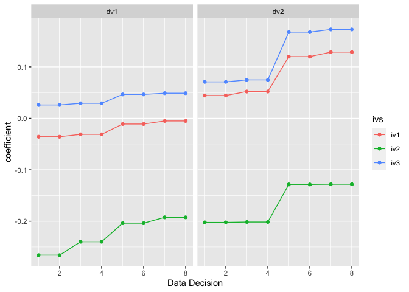

<!-- README.md is generated from README.Rmd. Please edit that file -->

<div style="text-align: center;">

<div>

<span style="font-size: 32px; font-weight: bold;">Plan · </span>
<span style="font-size: 32px; font-weight: bold;">Analyze · </span>
<span style="font-size: 32px; font-weight: bold;">Explore</span>

</div>


<br> <br>

<!-- badges: start -->

[](https://lifecycle.r-lib.org/articles/stages.html#experimental)
[](https://CRAN.R-project.org/package=multitool)
[](https://github.com/ethan-young/multiverse_tools/actions/workflows/R-CMD-check.yaml)
<!-- badges: end -->

</div>

## Installation

You can install the development version of `multitool` from
[GitHub](https://github.com/) with:

``` r
# install.packages("devtools")
devtools::install_github("ethan-young/multitool")
```

## Motivation

The goal of `multitool` is to provide a set of tools for designing and
running multiverse-style analyses. I designed it to help users create an
incremental workflow for slowly building up, keeping track of, and
unpacking multiverse analyses and results.

## Multiverse Primer

For those unfamiliar with multiverse analysis, here is a short primer:

<iframe width="100%" height="600" src="multiverse-primer.html" style="border: 2px #dee2e6 solid; border-radius: 5px;">
</iframe>

## Beyond Multiverse

I designed `multitool` to do multiverse analysis but its really just a
tool for exploration.

In any new field, area, or project, there is a lot of uncertainty about
which data analysis decisions to make. Clear research questions and
criteria help reduce uncertainty about how to answer them but they never
fully reduce them. `multitool` helps organize and systematically explore
different options. That’s really it.

## Design

I designed `multitool` to help users take a single use case (e.g., a
single analysis pipeline) and expand it into a workflow to include
alternative versions of the same analysis.

For example, imagine you would like to take some data, remove outliers,
transform variables, run a linear model, do a post-hoc analysis, and
plot the results. `multitool` can take theses tasks and transform them
into a blueprint, which provides instructions for running your analysis
pipeline.

The functions were designed to play nice with the
[`tidyverse`](https://www.tidyverse.org/) and require using the base R
pipe `|>`. This makes it easy to quickly convert a single analysis into
a multiverse analysis.

## Basic components

My vision of a `multitool` workflow contains five steps:


`multitool` cannot make decisions for you but – once you know your set
of data decisions – it can help you create and organize them into the
workflow above.

A defining feature of `multitool` is that it saves your code. This
allows the user to grab the *code that produces a result* and inspect it
for accuracy, errors, or simply for peace of mind. By quickly grabbing
code, the user can iterate between creating their blueprint and checking
that the code works as intended.

`multitool` allows the user to model data however they’d like. The user
is responsible for loading the relevant modeling packages. Regardless of
your model choice, `multitool` will capture your code and build a
blueprint with alternative analysis pipelines.

Finally, multiverse analyses were originally intended to look at how
model parameters shift as a function of arbitrary data decisions.
However, any computation might change depending on how you slice and
dice the data. For this reason, I also built functions for computing
descriptive, correlation, and reliability analysis alongside a
particular modelling pipeline.

## Usage

``` r
library(tidyverse)
library(multitool)

# create some data
the_data <-
  data.frame(
    id  = 1:100,
    iv1 = rnorm(100),
    iv2 = rnorm(100),
    iv3 = rnorm(100),
    mod = rnorm(100),
    dv1 = rnorm(100),
    dv2 = rnorm(100),
    include1 = rbinom(100, size = 1, prob = .1),
    include2 = sample(1:3, size = 100, replace = TRUE),
    include3 = rnorm(100)
  )

# create a pipeline blueprint
full_pipeline <- 
  the_data |>
  add_filters(include1 == 0, include2 != 3, include3 > -2.5) |> 
  add_variables(var_group = "ivs", iv1, iv2, iv3) |> 
  add_variables(var_group = "dvs", dv1, dv2) |> 
  add_model("linear model", lm({dvs} ~ {ivs} * mod))

full_pipeline
#> # A tibble: 12 × 3
#>    type      group        code                          
#>    <chr>     <chr>        <chr>                         
#>  1 filters   include1     include1 == 0                 
#>  2 filters   include1     include1 %in% unique(include1)
#>  3 filters   include2     include2 != 3                 
#>  4 filters   include2     include2 %in% unique(include2)
#>  5 filters   include3     include3 > -2.5               
#>  6 filters   include3     include3 %in% unique(include3)
#>  7 variables ivs          iv1                           
#>  8 variables ivs          iv2                           
#>  9 variables ivs          iv3                           
#> 10 variables dvs          dv1                           
#> 11 variables dvs          dv2                           
#> 12 models    linear model lm({dvs} ~ {ivs} * mod)

# Visualize the pipeline
create_blueprint_graph(full_pipeline)
```


``` r

# expand the pipeline
expanded_pipeline <- expand_decisions(full_pipeline)
expanded_pipeline
#> # A tibble: 48 × 4
#>    decision variables        filters          models          
#>    <chr>    <list>           <list>           <list>          
#>  1 1        <tibble [1 × 2]> <tibble [1 × 3]> <tibble [1 × 2]>
#>  2 2        <tibble [1 × 2]> <tibble [1 × 3]> <tibble [1 × 2]>
#>  3 3        <tibble [1 × 2]> <tibble [1 × 3]> <tibble [1 × 2]>
#>  4 4        <tibble [1 × 2]> <tibble [1 × 3]> <tibble [1 × 2]>
#>  5 5        <tibble [1 × 2]> <tibble [1 × 3]> <tibble [1 × 2]>
#>  6 6        <tibble [1 × 2]> <tibble [1 × 3]> <tibble [1 × 2]>
#>  7 7        <tibble [1 × 2]> <tibble [1 × 3]> <tibble [1 × 2]>
#>  8 8        <tibble [1 × 2]> <tibble [1 × 3]> <tibble [1 × 2]>
#>  9 9        <tibble [1 × 2]> <tibble [1 × 3]> <tibble [1 × 2]>
#> 10 10       <tibble [1 × 2]> <tibble [1 × 3]> <tibble [1 × 2]>
#> # ℹ 38 more rows

# Use your blueprint to run the multiverse
multiverse_results <- run_multiverse(expanded_pipeline)
multiverse_results
#> # A tibble: 48 × 3
#>    decision specifications   model_fitted    
#>    <chr>    <list>           <list>          
#>  1 1        <tibble [1 × 4]> <tibble [1 × 5]>
#>  2 2        <tibble [1 × 4]> <tibble [1 × 5]>
#>  3 3        <tibble [1 × 4]> <tibble [1 × 5]>
#>  4 4        <tibble [1 × 4]> <tibble [1 × 5]>
#>  5 5        <tibble [1 × 4]> <tibble [1 × 5]>
#>  6 6        <tibble [1 × 4]> <tibble [1 × 5]>
#>  7 7        <tibble [1 × 4]> <tibble [1 × 5]>
#>  8 8        <tibble [1 × 4]> <tibble [1 × 5]>
#>  9 9        <tibble [1 × 4]> <tibble [1 × 5]>
#> 10 10       <tibble [1 × 4]> <tibble [1 × 5]>
#> # ℹ 38 more rows

# Unpack some results
multiverse_results |> 
  reveal(.what = model_fitted, .which = lm_params, .unpack_specs = TRUE)
#> # A tibble: 192 × 18
#>    decision ivs   dvs   include1  include2 include3 model model_meta filter_code
#>    <chr>    <chr> <chr> <chr>     <chr>    <chr>    <chr> <chr>      <glue>     
#>  1 1        iv1   dv1   include1… include… include… lm(d… linear mo… the_data |…
#>  2 1        iv1   dv1   include1… include… include… lm(d… linear mo… the_data |…
#>  3 1        iv1   dv1   include1… include… include… lm(d… linear mo… the_data |…
#>  4 1        iv1   dv1   include1… include… include… lm(d… linear mo… the_data |…
#>  5 2        iv1   dv2   include1… include… include… lm(d… linear mo… the_data |…
#>  6 2        iv1   dv2   include1… include… include… lm(d… linear mo… the_data |…
#>  7 2        iv1   dv2   include1… include… include… lm(d… linear mo… the_data |…
#>  8 2        iv1   dv2   include1… include… include… lm(d… linear mo… the_data |…
#>  9 3        iv2   dv1   include1… include… include… lm(d… linear mo… the_data |…
#> 10 3        iv2   dv1   include1… include… include… lm(d… linear mo… the_data |…
#> # ℹ 182 more rows
#> # ℹ 9 more variables: parameter <chr>, coefficient <dbl>, se <dbl>, ci <dbl>,
#> #   ci_low <dbl>, ci_high <dbl>, t <dbl>, df_error <int>, p <dbl>

# Summarize an effect
multiverse_results |> 
  reveal(.what = model_fitted, .which = lm_params, .unpack_specs = TRUE) |> 
  filter(str_detect(parameter, "iv")) |> 
  condense(coefficient, list(mean = mean, median = median))
#> # A tibble: 1 × 2
#>   coefficient_mean coefficient_median
#>              <dbl>              <dbl>
#> 1         -0.00802            -0.0319

# Plot your effects
multiverse_results |> 
  reveal(.what = model_fitted, .which = lm_params, .unpack_specs = TRUE) |> 
  filter(str_detect(parameter, "^iv\\d$")) |> 
  group_by(ivs, dvs) |> 
  mutate(sorted_decision = fct_reorder(as_factor(decision), coefficient) |> as.numeric()) |> 
  ggplot(aes(x = sorted_decision, y = coefficient, color = ivs)) +
  geom_line() +
  geom_point() +
  facet_wrap(~dvs, scales = "free_x") +
  scale_x_continuous("Data Decision")
```


